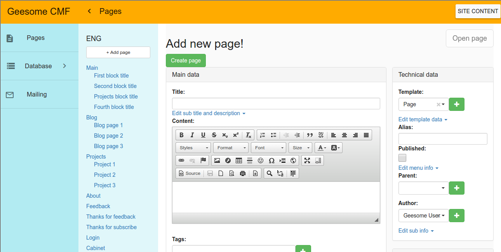

# Laravel CMF(CMS)

Content managment system based on [laravel framework](https://laravel.com/) with its templates and controller actions.

Admin panel built with AngularJS, and has the opportunity of drag and drop pages tree, flexible page and mailing forms create/edit functionality.

Designed for developers who want to have basic CMS functions as pages, templates, roles, multilanguage and mailing managment with possibilities for further development with powerful framework.

## Demo

Client side:  
http://lanit.jonybang.ru/

Admin side:  
http://lanit.jonybang.ru/admin  
User: test.lanit.cms@openmail.cc  
Password: Lt192837



Demo site built completely using [database seeds](database/seeds). In these files developer can trace relations of CMF entities.

## Overview

Architecture design of the project takes basic concept from [MODX CMF](https://modx.com/) in admin interface and database scheme.

This CMF uses all advantages of Laravel framework on its backend. That allows to provide all advantages of MVC and get rid of all restrictions of custom CMS/CMF (e.g. MODX itself).

General entities:  
- [Page](app/Models/Page.php) - page entity, that has title, alias(uri), description, content, is_published flag and other general page info. Same of MODX Resource;
- [Template](app/Models/Template.php) - entity with [key](database/migrations/2016_06_05_030526_create_templates_table.php#L18) field, specifies the path at laravel template in [resources/views/templates](resources/views/templates) folder, this is used to render page with its data, contained in the {{$page}} variable. [Here](database/seeds/TemplatesTableSeeder.php#L16) is example of Template, which is bound with [this laravel template file](resources/views/templates/blog.blade.php). Template is the same as MODX Template;
- [SubField](app/Models/SubField.php) - bound to templates to include custom data for pages, like images, sliders, custom text blocks, etc. Available in templates as variable named by [key](database/migrations/2016_06_05_092703_create_sub_fields_table.php#L18) field. Same as ModX template variables - TVs;
- [ControllerAction](app/Models/ControllerAction.php) - bound to template to execute Laravel controller action before page render. Such controller action can return data to be rendered at the page. Like MODX snippets;
- [Setting](app/Setting.php) - global parameters to adjust backend/frontend behavior or mode. It can be fetched in templates using [key](database/migrations/2016_06_05_050515_create_settings_table.php#L18) field;
- [Translations](https://github.com/barryvdh/laravel-translation-manager/blob/master/src/Models/Translation.php) - database objects, which synchronize with [laravel transaltions](https://laravel.com/docs/master/localization) with help of [barryvdh/laravel-translation-manager](https://github.com/barryvdh/laravel-translation-manager) package. [Api/TranslationController](app/Http/Controllers/Api/TranslationController.php) provides manage of these translations from admin panel.

Sub entites:  
- [Context](app/Models/Context.php) - Entites for grouping pages by some appointment(locale for example), which have possibility of override general site settings;
- [UserActionLog](app/Models/UserActionLog.php) - User actions are logged in database, including data about the action (create, update, delete);
- [SubscriberGroup](app/Models/SubscriberGroup.php) and [Subscriber](app/Models/Subscriber.php) - used to setup mailings;
- [MailTemplate](app/Models/MailTemplate.php) - mailings templates with support of [Blade](https://laravel.com/docs/5.0/templates) syntax (allows to use variables). Templates are stored in database, and can be edited inside admin panel; [Here](database/seeds/MailingSeeder.php#L14) is example of MailTemplate;
- [SentMail](app/Models/SentMail.php) - for possibly of resend previosly sent mails.

## Official Documentation

The project is now on beta version, and soon, when the first version - his will be documented.

## Backend and frontend

Now backend core is located in [app/Http/routes.php](https://github.com/Jonybang/Lanit-Laravel-CMF/blob/master/app/Http/routes.php) file.
In core uses multilanguage routes with [mcamara/laravel-localization](https://github.com/mcamara/laravel-localization) package

Frontend core(Admin panel) located in [public/assets/js/admin-app](https://github.com/Jonybang/Lanit-Laravel-CMF/tree/master/public/assets/js/admin-app) folder and used [Awesome edit](https://github.com/Jonybang/awesome-edit) angular module for manage database tables and admin forms. Frontend architecture develop with DRY principle, adheres to the minimalist approach of development and has some specified and bulky code only in create/edit controllers and directives of complex forms(like [page-form-controller.js](public/assets/js/admin-app/modules/page-form/page-form-controller.js) and [mailing-controller.js](public/assets/js/admin-app/modules/site-manage/mailing/mailing-controller.js))

Frontend and backend separated by REST API, and if desired developer can build his frontend for use created backend.

## Clone for modify admin panel with submodules:

```
git pull && git submodule init && git submodule update && git submodule status
```

## TODO:

- Move to laravel package(for example [Riari/laravel-forum](https://github.com/Riari/laravel-forum));
- More customizable sub fields on admin panel(custom directives in a-edit grid);
- Rename some entities;
- Reusable components;
- Bind translations pages(same as Babel on MODX);
- More beauty admin panel;
- Move angular app to resources folder for compile into public/assets.
