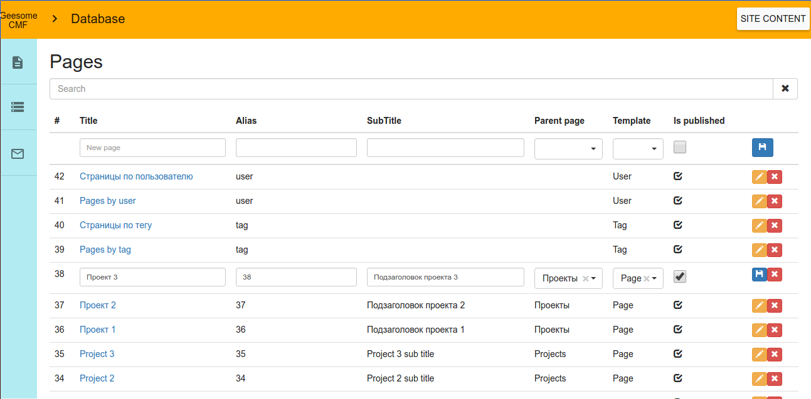

# Geesome Laravel CMF(CMS)

Content management system based on [laravel framework](https://laravel.com/) with its templates and controller actions.

Admin panel built with AngularJS, and has the opportunity of drag and drop pages tree, flexible page and mailing forms create/edit functionality.

Designed for developers who want to have basic CMS functions as pages, templates, roles, multilanguage and mailing managment with possibilities for further development with powerful framework.

## Demo

Client side:  
http://geesome.jonybang.ru/

Admin side:  
http://geesome.jonybang.ru/admin  
User: geesome.test@openmail.cc  
Password: Gm192837

Page form:

Database edit:


Demo site built completely using [database seeds](database/seeds). In these files developer can trace relations of CMF entities.

## Getting started

Generally you just must to clone repo, getting worked laravel, change as you wish and apply database seeds, then open site by artisan serve or nginx or whatever.  

### Step by step(on Ubuntu 14 for example)

Clone repo:
```
git clone https://github.com/Jonybang/Geesome-CMF && cd Geesome-CMF
```
Automatically install php and mysql requirements:
```
sudo chmod +x bash/install-ubuntu-14 && bash/install-ubuntu-14
```
Automatically install and init laravel requirements:
```
sudo chmod +x bash/init-server && bash/init-server
```
Change and apply [seeds](database/seeds) to try demo database:
```
php artisan migrate:refresh --seed
```
Run artisan serve and open <http://localhost:8000>:
```
php artisan serve
```

## How to use

For customize of site content on that CMF you must to manage database([Pages](app/Models/Page.php), [Templates](app/Models/Template.php), [SubFields](app/Models/SubField.php), 
[ControllerActions](app/Models/ControllerAction.php), [Settings](app/Models/Setting.php) and [Translations](https://github.com/barryvdh/laravel-translation-manager/blob/master/src/Models/Translation.php)), [templates](resources/views/templates) and [controllers](app/Http/Controllers).

Laravel views bound to [Pages](app/Models/Page.php) by relation to [Templates](app/Models/Template.php), which has key field for point to Laravel views in [template folder](resources/views/templates).

Actions of controllers bound to [Pages](app/Models/Page.php) by relation to [Templates](app/Models/Template.php), which has relation with [ControllerActions](app/Models/ControllerAction.php). You can see example in [Tag page seeder](database/seeds/TagPageTableSeeder.php).

[SubFields](app/Models/SubField.php) can create in database for make more editable info on [Pages](app/Models/Page.php). [SubFields](app/Models/SubField.php) bound to Pages by relation to [Templates](app/Models/Template.php). You can see example in [Tag page seeder](database/seeds/ImageSubFieldsTableSeeder.php).

## Overview

Architecture design of the project takes basic concept from [MODX CMF](https://modx.com/) in admin interface and database scheme.

This CMF uses all advantages of Laravel framework on its backend. That allows to provide all advantages of MVC and get rid of all restrictions of custom CMS/CMF (e.g. MODX itself).

General entities:  
- [Page](app/Models/Page.php) - page entity, that has title, alias(uri), description, content, is_published flag and other general page info. Same of MODX Resource;
- [Template](app/Models/Template.php) - entity with [key](database/migrations/2016_06_05_030526_create_templates_table.php#L18) field, specifies the path at laravel template in [resources/views/templates](resources/views/templates) folder, this is used to render page with its data, contained in the {{$page}} variable. [Here](database/seeds/TemplatesTableSeeder.php#L16) is example of Template, which is bound with [this laravel template file](resources/views/templates/blog.blade.php). Template is the same as MODX Template;
- [SubField](app/Models/SubField.php) - bound to templates to include custom data for pages, like images, sliders, custom text blocks, etc. Available in templates as variable named by [key](database/migrations/2016_06_05_092703_create_sub_fields_table.php#L18) field. Same as ModX template variables - TVs;
- [ControllerAction](app/Models/ControllerAction.php) - bound to template to execute Laravel controller action before page render. Such controller action can return data to be rendered at the page. Like MODX snippets;
- [Setting](app/Models/Setting.php) - global parameters to adjust backend/frontend behavior or mode. It can be fetched in templates using [key](database/migrations/2016_06_05_050515_create_settings_table.php#L18) field;
- [Translations](https://github.com/barryvdh/laravel-translation-manager/blob/master/src/Models/Translation.php) - database objects, which synchronize with [laravel transaltions](https://laravel.com/docs/master/localization) with help of [barryvdh/laravel-translation-manager](https://github.com/barryvdh/laravel-translation-manager) package. [Api/TranslationController](app/Http/Controllers/Api/TranslationController.php) provides manage of these translations from admin panel.

Sub entites:  
- [Context](app/Models/Context.php) - Entites for grouping pages by some appointment(locale for example), which have possibility of override general site settings;
- [UserActionLog](app/Models/UserActionLog.php) - User actions are logged in database, including data about the action (create, update, delete);
- [SubscriberGroup](app/Models/SubscriberGroup.php) and [Subscriber](app/Models/Subscriber.php) - used to setup mailings;
- [MailTemplate](app/Models/MailTemplate.php) - mailings templates with support of [Blade](https://laravel.com/docs/5.0/templates) syntax (allows to use variables). Templates are stored in database, and can be edited inside admin panel; [Here](database/seeds/MailingSeeder.php#L14) is example of MailTemplate;
- [SentMail](app/Models/SentMail.php) - for possibly of resend previosly sent mails.

## Requirements

**MySQL 5.7.8+** - [for support json](http://stackoverflow.com/a/36017215) field. [Install instruction for ubuntu 14](https://www.digitalocean.com/community/questions/mysql-5-7-x-on-ubuntu-14-lamp-already-installed).  
**PHP 5.6.19+**(7+ recommended) - [for support json](http://stackoverflow.com/a/34295663) field too. [Install instructions 7.0 for ubuntu 14](https://www.digitalocean.com/community/tutorials/how-to-upgrade-to-php-7-on-ubuntu-14-04)

## Backend and frontend

Now backend core is located in [app/Http/routes.php](app/Http/routes.php) file.
In core uses multilanguage routes with [mcamara/laravel-localization](https://github.com/mcamara/laravel-localization) package

Frontend core(Admin panel) located in [public/assets/angular/admin_app](public/assets/angular/admin_app) folder and used [Awesome edit](https://github.com/Jonybang/awesome-edit) as angular module for manage database tables and admin forms. 
Frontend architecture develop with DRY principle, adheres to the minimalist approach of development and has some specified and bulky code only in create/edit controllers and directives of complex forms
(like [page-form.controller.js](public/assets/angular/admin_app/modules/pages/page_form/page_form.controller.js) and [mail-form.controller.js](public/assets/angular/admin_app/modules/mailing/mail_form.controller.js))

Frontend and backend separated by REST API, and if desired developer can build his frontend for use created backend.


## How to modify angular admin panel

Clone or pull repo with submodule([Awesome edit](https://github.com/Jonybang/awesome-edit)):

```
# pull
git pull && git submodule init && git submodule update && git submodule status
# or clone
git clone https://github.com/Jonybang/Geesome-CMF --recurse-submodules
```

Install gulp and run gulp:

```
bash/init-gulp
```

## Material design frontend info

Angular material: https://material.angularjs.org/latest/getting-started

Icons: https://design.google.com/icons/

Colors: https://material.google.com/style/color.html

## TODO:

- Move to laravel package(for example [Riari/laravel-forum](https://github.com/Riari/laravel-forum));
- Rename some entities;
- Reusable components;
- View and control of bind translations pages(same as Babel on MODX);
- Complete material design integration;
- Move angular app to resources folder for compile into public/assets;
- Documentation;
- Tests.
